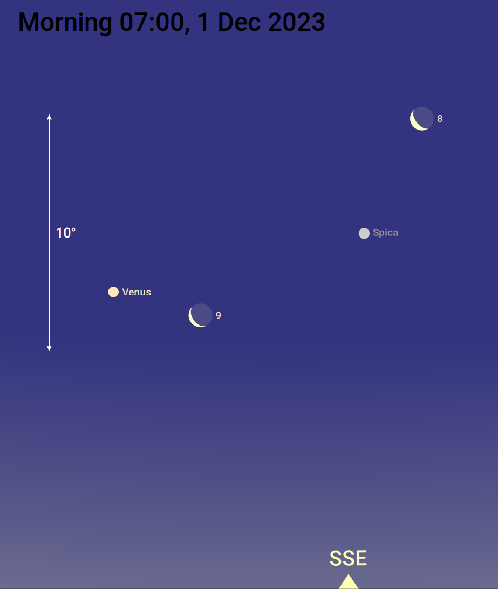
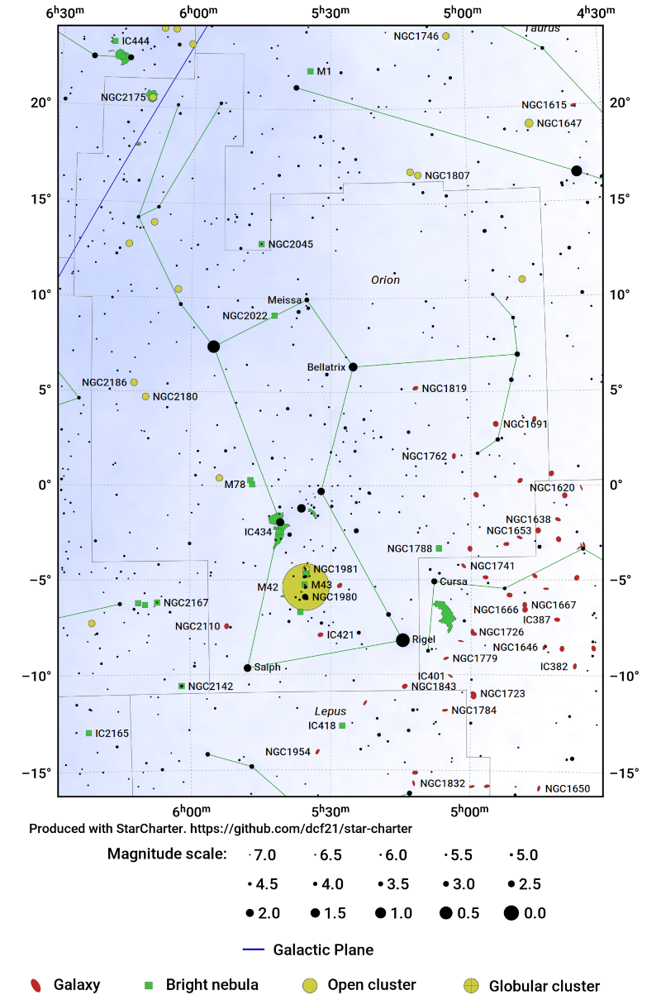
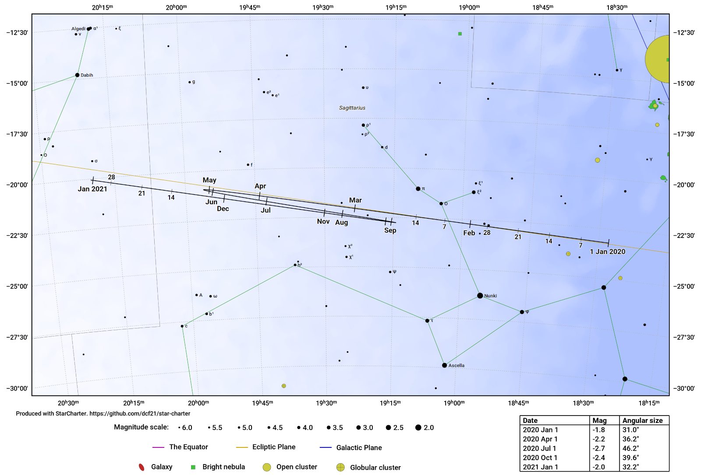

# StarCharter

`StarCharter` is a versatile command-line tool for producing charts of the
night sky. Charts can be generated relative to the local horizon, depicting the
sky as seen from a particular location at a particular time, or as a star atlas
in equatorial or galactic coordinates.  A large array of configuration options
are available to allow the charts to be fully customised.

`StarCharter` can depict the positions of solar system objects - planets,
asteroids and comets - retrieving their positions from NASA's DE430 ephemeris,
and the paths of these objects across the sky over a specified time period can
also be shown.

Charts can be generated in either PNG (bitmap graphics) format for quick
viewing and use online, or in PDF/SVG/EPS (vector graphics) formats for
subsequent typesetting or editing in a vector graphics package such as Adobe
Illustrator or Inkscape.

`StarCharter` was originally developed to produce star charts for the website
<https://in-the-sky.org>.

### Example output

This section shows a small number of examples of the output of `StarCharter`:

1. The sky as seen looking south from London on 1 December 2023:


Generated by [this script](examples/local_sky_202312_wide.sch).

2. The location and phase of the Moon as it passes Spica and Venus on 1
December 2023:



Generated by [this script](examples/local_sky_202312_moon.sch).

3. A chart of the constellation of Orion:



Generated by [this script](examples/orion.sch).

4. A chart of the path of Jupiter in the year 2020:



Generated by [this script](examples/jupiter_ephemeris.sch).

### License

This code is distributed under the Gnu General Public License. It is (C)
Dominic Ford 2015 - 2024.

### Supported operating systems

`StarCharter` is written in C and runs in Linux, macOS, and other Unix-like
operating systems.  A Docker container is provided to facilitate running
`StarCharter` in the widest possible range of operating systems. The
installation scripts require Python 3.  `StarCharter` uses `libcairo` to
produce its graphical output.

The build process requires a minimum of 4GB RAM. Note that Docker Desktop for
macOS imposes a default memory limit of 2GB, which needs to be increased to
build `StarCharter` successfully.

### Build process

First make a clone of the code in this GitHub repository:

```
git clone https://github.com/dcf21/star-charter.git
```

If you wish to run `StarCharter` locally (not within a Docker container), then
you must run the shell script `setup.sh` to download the data required by each
tool and to compile the software.  This script downloads various data from the
internet, including the DE430 solar system ephemeris, star catalogues, deep sky
catalogues, and an image of the Milky Way to use to shade the background of
star charts.

The total download size will be around 500 MB, and it will take around 10-15
minutes to process the downloaded files.

Note that once you have built `StarCharter`, you must not change its location
within your file system.  During the build process, the absolute path to the
downloaded data files is stored, and the code will be unable to find these data
files if their path changes. If you move the code, you must fully rebuild the
code:

```
make clean
./setup.sh
```

### Docker container

If you would rather run `StarCharter` within a Docker container, then a
`Dockerfile` is provided to build such a container.  This automatically
installs all the software's dependencies within the containerised environment
to make the build process as simple as possible. Additionally, a `docker
compose` script is provided, which automatically build a selection of example
star charts.

To build the `StarCharter` container (this takes 15 minutes):

```
docker compose build
```

To generate a selection of example charts, which are placed in the directory
`examples/output`:

```
docker compose run star-charter
```

To make other star charts, open a shell within the Docker container as follows:

```
docker run -it star-charter:v6 /bin/bash
```

## Generating your own star charts

The configuration options for each star chart are specified in a configuration
file, where options are specified in the format

```
<option_name>=<option_value>
```

The available options include which portion of the sky should be charted, what
labels should be placed on the chart, etc.  The directory `examples` within
this repository contains numerous example configuration files, and there is a
complete list of all the available configuration options below.

There are some examples in the `examples` directory, and so a good starting
point is to generate one of these:

```
cd examples
../bin/starchart.bin orion.sch
```

This will generate a chart of the constellation Orion in the `output`
directory. Three files are created, in PNG, SVG and PDF formats.

The file `orion.sch` reads as follows:

```
DEFAULTS
ra_central=5.5
dec_central=4.0
angular_width=29.0
mag_min=7
width=15.0
aspect=1.41421356
show_grid_lines=1
constellation_boundaries=1
constellation_sticks=1
coords=ra_dec
projection=stereographic
star_names=1
star_flamsteed_labels=0
constellation_names=1
plot_galaxy_map=1
plot_equator=0
plot_ecliptic=0
plot_galactic_plane=1
font_size=1.2

CHART
output_filename=output/orion.png

CHART
output_filename=output/orion.svg

CHART
output_filename=output/orion.pdf
```

Settings are arranged in blocks which are headed by the words `DEFAULTS` or
`CHART`. Settings in a `DEFAULTS` block do not themselves produce a star chart,
but change the default settings which are applied to all subsequent charts.
Settings in a `CHART` relate to a specific chart that is to be rendered, and do
not affect any subsequent charts which may be rendered later in the same
configuration file.

The file above configures the required parameters to produce a chart of the
constellation Orion, and makes these the default settings. It then produces
three copies of the star chart, in three different graphic formats.

A complete list of all the configuration settings which are recognised are
listed below under 'Configuration settings'.

## Configuration settings

The following settings can be included in a `StarCharter` configuration file:

* `alt_central` - The local altitude of the centre of the plot; degrees. This setting is only used if `coords=alt_az`.
* `angular_width` - The angular width of the star chart on the sky; degrees
* `aspect` - The aspect ratio of the star chart: i.e. the ratio height/width
* `axis_label` - Boolean (0 or 1) indicating whether to write "Right ascension" and "Declination" on the vertical/horizontal axes
* `axis_ticks_value_only` - If 1, axis labels will appear as simply "5h" or "30 deg". If 0, these labels will be preceded by alpha= or delta=
* `az_central` - The local azimuth of the centre of the plot; degrees. This setting is only used if `coords=alt_az`.
* `cardinals` - Boolean (0 or 1) indicating whether to write the cardinal points around the edge of alt/az star charts
* `chart_edge_line_width` - Line width to use when marking the edge of the chart. Default 2.5.
* `constellation_boundaries` - Boolean (0 or 1) indicating whether we draw constellation boundaries
* `constellation_boundary_col` - Colour to use when drawing constellation boundaries
* `constellation_highlight` - Optionally, highlight the boundary of one particular constellation, identified by a three-letter abbreviation.
* `constellation_label_col` - Colour to use when writing constellation names
* `constellation_names` - Boolean (0 or 1) indicating whether we label the names of constellations
* `constellation_stick_col` - Colour to use when drawing constellation stick figures
* `constellation_stick_design` - Select which design of constellation stick figures we should draw. Set to either `simplified` or `rey`. See <https://github.com/dcf21/constellation-stick-figures> for more information.
* `constellation_sticks_line_width` - Line width to use when drawing constellation stick figures. Default 1.4.
* `constellation_sticks` - Boolean (0 or 1) indicating whether we draw constellation stick figures
* `constellations_capitalise` - Boolean (0 or 1) indicating whether we capitalise the names of constellations.
* `constellations_label_shadow` - Boolean (0 or 1) indicating whether to draw a shadow behind the names of the constellations.
* `coords` - Select which celestial coordinate system to use when specifying the centre of the plot. Set to `ra_dec`, `galactic` or `alt_az`.
* `copyright_gap_2` - Spacing of the copyright text beneath the plot
* `copyright_gap` - Spacing of the copyright text beneath the plot
* `copyright` - The copyright string to write under the star chart
* `dec_central` - The declination of the centre of the plot; degrees. This setting is only used if `coords=ra_dec`.
* `draw_ephemeris` - Definitions of ephemerides to draw. Each definition should take the form of: `<bodyId>,<jdMin>,<jdMax>` (see above). To draw multiple ephemeride, specify this setting multiple times within your configuration file.
* `dso_cluster_col` - Colour to use when drawing star clusters
* `dso_display_style` - Select which style to use for deep sky objects. Set to either `coloured` or `fuzzy`. Default is `coloured`.
* `dso_galaxy_col` - Colour to use when drawing galaxies
* `dso_label_col` - Colour to use when writing the labels for deep sky objects
* `dso_label_mag_min` - Do not label stars fainter than this magnitude limit (default: unlimited)
* `dso_mag_min` - Only show deep-sky objects down to this faintest magnitude
* `dso_mags` - Boolean (0 or 1) indicating whether we label the magnitudes of deep-sky objects
* `dso_names` - Boolean (0 or 1) indicating whether we label the names of deep-sky objects
* `dso_nebula_col` - Colour to use when drawing nebulae
* `dso_outline_col` - Colour to use when drawing the outline of deep-sky objects
* `dso_point_size_scaling` - Size scaling of deep-sky object symbols. Default 1.
* `dso_symbol_key` - Boolean (0 or 1) indicating whether we include a key to the symbols used to represent deep-sky objects
* `ecliptic_col` - Colour to use when drawing a line along the ecliptic
* `ephemeris_arrow_col` - Colours to use when drawing ephemeris arrows drawn when `ephemeris_style` = `side_by_side_with_arrow`. If this setting is supplied multiple times, then the list of supplied colours are used in a cyclic loop for all the solar system objects to be drawn.
* `ephemeris_arrow_shadow` - Boolean (0 or 1) indicating whether the ephemeris arrows drawn when `ephemeris_style` = `side_by_side_with_arrow` should have a shadow to make them more visible.
* `ephemeris_autoscale` - Boolean (0 or 1) indicating whether to auto-scale the star chart to contain the requested ephemerides. This overrides settings for `ra_central`, `dec_central`, `angular_width`, as well as other parameters. Run the code in debugging mode to see a list of the values assigned to all these automatically-set parameters.
* `ephemeris_col` - Colours to use when drawing ephemerides for solar system objects. If this setting is supplied multiple times, then the list of supplied colours are used in a cyclic loop for all the solar system objects to be drawn.
* `ephemeris_epochs` - List of JD time epochs for which we should create points along each solar system ephemeris. If empty, then points are created automatically. This list must have the same length as <ephemeris_epoch_labels>. To draw multiple epochs, specify this setting multiple times within your configuration file.
* `ephemeris_epoch_labels` - List of text labels for the points we create along each solar system ephemeris. If empty, then points are created automatically. This list must have the same length as <ephemeris_epochs>. To draw multiple epochs, specify this setting multiple times within your configuration file.
* `ephemeris_label_col` - Colours to use when labelling ephemerides for solar system objects. If this setting is supplied multiple times, then the list of supplied colours are used in a cyclic loop for all the solar system objects to be drawn.
* `ephemeris_style` - Select the style to use when showing the tracks of solar system objects. Set to `track`, `side_by_side`, `side_by_side_with_track` or `side_by_side_with_arrow`.
* `equator_col` - Colour to use when drawing a line along the equator
* `font_family` - The font family to use when rendering all text labels.
* `font_size` - A normalisation factor to apply to the font size of all text (default 1.0)
* `galactic_b_central` - The galactic latitude of the centre of the plot; degrees. This setting is only used if `coords=galactic`.
* `galactic_l_central` - The galactic longitude of the centre of the plot; degrees. This setting is only used if `coords=galactic`.
* `galactic_plane_col` - Colour to use when drawing a line along the galactic plane
* `galaxy_col0` - The colour to use to shade the dark parts of the map of the Milky Way
* `galaxy_col` - The colour to use to shade the bright parts of the map of the Milky Way
* `galaxy_map_filename` - The binary file from which to read the shaded map of the Milky Way
* `galaxy_map_width_pixels` - The number of horizontal pixels across the shaded map of the Milky Way
* `great_circle_key` - Boolean (0 or 1) indicating whether to draw a key to the great circles under the star chart
* `great_circle_line_width` - Line width to use when marking great circles on the sky (e.g. the equator and the ecliptic). Default 1.75.
* `great_circle_dotted` - Boolean (0 or 1)  indicating whether to use a dotted line when tracing great circles
* `grid_col` - Colour to use when drawing grid of RA/Dec (or Alt/Az, or galactic coordinate) lines
* `grid_coords` - Select which celestial coordinate system to trace with grid lines. Set to `ra_dec`, `galactic` or `alt_az`.
* `grid_line_width` - Line width to use when drawing grid lines. Default 1.3.
* `horizon_cardinal_points_labels_col` - Colour to use when drawing cardinal-point labels along the horizon.
* `horizon_cardinal_points_marker_col` - Colour to use when drawing cardinal-point markers along the horizon.
* `horizon_cardinal_points_marker_count` - Number of cardinal-point markers to place along the horizon. Sensible values are 4, 8, 16. Default 8.
* `horizon_cardinal_points_marker_elevate` - Boolean flag (0 or 1) indicating whether to elevate cardinal point markers to the bottom of the field of view if they fall off the bottom of the chart.
* `horizon_cardinal_points_marker_size` - Size scaling of the cardinal-point markers along the horizon. Default 1.
* `horizon_latitude` - Terrestrial latitude for which to show the local horizon; degrees
* `horizon_longitude` - Terrestrial longitude for which to show the local horizon; degrees
* `horizon_zenith_marker_size` - Scaling factor to apply to the size of the marker used at the zenith. Default 1.
* `horizon_zenith_col` - Colour to use for the marker at the zenith.
* `julian_date` - Julian date for which to show local horizon, with which to measure alt/az, and for which to show the positions of solar system bodies.
* `label_ecliptic` - Boolean (0 or 1) indicating whether to label the months along the ecliptic, showing the Sun's annual progress
* `label_font_size_scaling` - Scaling factor to be applied to the font size of all star and DSO labels (default 1.0)
* `language` - The language used for the constellation names. Either `english` or `french`.
* `mag_alpha` - The multiplicative scaling factor to apply to the radii of stars differing in magnitude by one `mag_step`
* `mag_max` - Used to regulate the size of stars. A star of this magnitude is drawn with size mag_size_norm. Also, this is the brightest magnitude of star which is shown in the magnitude key below the chart.
* `mag_min` - The faintest magnitude of star which we draw
* `magnitude_key` - Boolean (0 or 1) indicating whether to draw a key to the magnitudes of stars under the star chart
* `mag_size_norm` - The radius of a star of magnitude `mag_max` (default 1.0)
* `mag_step` - The magnitude interval between the samples shown on the magnitude key under the chart
* `maximum_dso_count` - The maximum number of deep-sky objects to draw. If this is exceeded, only the brightest objects are shown.
* `maximum_dso_label_count` - The maximum number of deep-sky objects which may be labelled
* `maximum_star_count` - The maximum number of stars to draw. If this is exceeded, only the brightest stars are shown.
* `maximum_star_label_count` - The maximum number of stars which may be labelled
* `messier_only` - Boolean (0 or 1) indicating whether we plot only Messier objects, and no other deep-sky objects
* `meteor_radiant` - Specify that the radiant of a meteor shower should be marked. This should be set to a string of the form `<shower_label>,<ra_radiant/deg>,<dec_radiant/deg>`. To mark multiple shower radiants, supply this setting multiple times.
* `meteor_radiant_marker_size` - Scaling factor to apply to the size of the markers at the radiants of meteor showers. Default 1.
* `meteor_radiant_colour` - Colour to use for the markers at the radiants of meteor showers.
* `must_show_all_ephemeris_labels` - Boolean (0 or 1) indicating whether we show all ephemeris text labels, even if they collide with other text.
* `output_dpi` - The DPI resolution of the output file. Default 200 DPI for PNG files; 72 DPI for vector graphics.
* `output_filename` - The target filename for the star chart. The file type (`svg`, `png`, `eps` or `pdf`) is inferred from the file extension.
* `photo_filename` - The filename of a PNG image to render behind the star chart. Leave blank to show no image.
* `plot_dso` - Boolean (0 or 1) indicating whether we plot any deep-sky objects
* `plot_ecliptic` - Boolean (0 or 1) indicating whether to draw a line along the ecliptic
* `plot_equator` - Boolean (0 or 1) indicating whether to draw a line along the equator
* `plot_galactic_plane` - Boolean (0 or 1) indicating whether to draw a line along the galactic plane
* `plot_galaxy_map` - Boolean (0 or 1) indicating whether to draw a shaded map of the Milky Way behind the star chart
* `plot_stars` - Boolean (0 or 1) indicating whether we plot any stars
* `position_angle` - The position angle of the plot - i.e. the tilt of north in degrees, counter-clockwise from up, at the centre of the plot
* `projection` - Select projection to use. Set to `stereographic` (default; maximum width 360 degrees), `flat` (a rectangular map of RA/Dec), `peters` (a rectangular map in a Peters projection), `gnomonic` (maximum width 180 degrees), `sphere` (a celestial globe viewed from the outside) or `alt_az` (a hemisphere of a sky above a location, viewed from the output).
* `ra_central` - The right ascension of the centre of the plot; hours, J2000.0.  This setting is only used if `coords=ra_dec`.
* `scale_bar` - List of scale bars we should super-impose over the star chart. Each should be specified as: <x_pos>,<y_pos>,<position_angle>,<degrees> where <x_pos> and <y_pos> are 0-1, the position angle is a clockwise rotation in degrees, and degrees is the length of the scale bar on the sky. To draw multiple scale bars, specify this setting multiple times within your configuration file.
* `scale_bar_col` - Colour to use for scale bars.
* `shade_twilight` - Boolean (0 or 1) indicating whether to shade the sky according to the altitude in the local sky at `julian_date`.
* `shade_near_sun` - Boolean (0 or 1) indicating whether to shade the region of sky that is close to the Sun at `julian_date`.
* `shade_not_observable` - Boolean (0 or 1) indicating whether to shade the region of sky that is not observable at any time of day at `julian_date`.
* `show_grid_lines` - Boolean (0 or 1) indicating whether we draw a grid of RA/Dec lines in background of star chart
* `show_horizon` - Boolean (0 or 1) indicating whether we show the local horizon and clip objects below the horizon at `julian_date`
* `show_solar_system` - Boolean (0 or 1) indicating whether we show the positions of solar system bodies at `julian_date`
* `show_zenith` - Boolean (0 or 1) indicating whether we mark the local zenith at `julian_date`
* `solar_system_col` - The colour to use when drawing solar-system objects. If this setting is supplied multiple times, then the list of supplied colours are used in a cyclic loop for all the solar system objects to be drawn.
* `solar_system_ids` - The list of the ID strings of the solar system bodies to show (e.g. `P1` for Mercury). If multiple solar system bodies are to be displayed/labelled, then specify this setting multiple times, once for each body. The number of values of <solar_system_ids> must equal the number of values of <solar_system_labels>.
* `solar_system_labels` - The list of labels to show next to the selected solar system bodies. If multiple solar system bodies are to be displayed/labelled, then specify this setting multiple times, once for each body. The number of values of <solar_system_ids> must equal the number of values of <solar_system_labels>.
* `solar_system_show_moon_phase` - Boolean flag (0 or 1) indicating whether to show the Moon's phase (1), or show a simple marker (0).
* `solar_system_moon_earthshine_intensity` - The fractional intensity of Earthshine on the Moon's unilluminated portion, compared to the illuminated Moon. Default: 0.12.
* `solar_system_moon_colour` - The colour to use to represent the illuminated portion of the Moon.
* `star_allow_multiple_labels` - Boolean (0 or 1) indicating whether we allow multiple labels next to a single star. If false, we only include the highest-priority label for each object.
* `star_bayer_labels` - Boolean (0 or 1) indicating whether we label the Bayer numbers of stars
* `star_catalogue_numbers` - Boolean (0 or 1) indicating whether we label the catalogue numbers of stars
* `star_catalogue` - Select the star catalogue to use when showing the catalogue numbers of stars. Set to `hipparcos`, `ybsc` or `hd`.
* `star_col` - Colour to use when drawing stars
* `star_flamsteed_labels` - Boolean (0 or 1) indicating whether we label the Flamsteed designations of stars
* `star_label_mag_min` - Do not label stars fainter than this magnitude limit (default: unlimited)
* `star_mag_labels` - Boolean (0 or 1) indicating whether we label the magnitudes of stars
* `star_names` - Boolean (0 or 1) indicating whether we label the English names of stars
* `star_variable_labels` - Boolean (0 or 1) indicating whether we label the variable-star designations of stars, e.g. V337_Car
* `text` - Overlay a custom text label on the star chart. Each label should be specified in the format `<xpos>,<ypos>,<xalign>,<yalign>,<font_size>,<colour r>,<colour g>,<colour b>,<label string>`, where `xpos` and `ypos` are in the range 0-1, `xalign` and `yalign` are in the range -1 (left) to 1 (right), and colour components are in the range 0-1. To overlay multiple text labels, specify this setting multiple times within your configuration file. 
* `title` - The heading to write at the top of the star chart
* `twilight_zenith_col` - The colour to use to shade twilight at the zenith
* `twilight_horizon_col` - The colour to use to shade twilight at the horizon
* `width` - The width of the star chart, in cm
* `x_label_slant` - A slant to apply to all labels on the horizontal axes
* `y_label_slant` - A slant to apply to all labels on the vertical axes
* `zodiacal_only` - Boolean (0 or 1) indicating whether we plot only the zodiacal constellations

## Paths of solar system objects

The `draw_ephemeris` option in a configuration file can be used to draw the
path of a solar system object across the sky. The syntax is as follows:

```
draw_ephemeris = <body>,<jd_start>,<jd_end>
```

where `body` is the name of the solar system object to plot, and `jd_start` and
`jd_end` are the Julian day numbers of the beginning and end of the time period
for which the object's path should be plotted.

Recognised object names include any of the following:

* `p1`, `pmercury`, `mercury`: Mercury
* `p2`, `pvenus`, `venus`: Venus
* `p3`, `pearth`, `earth`: Earth
* `p301`, `pmoon`, `moon`: The Moon
* `p4`, `pmars`, `mars`: Mars
* `p5`, `pjupiter`, `jupiter`: Jupiter
* `p6`, `psaturn`, `saturn`: Saturn
* `p7`, `puranus`, `uranus`: Uranus
* `p8`, `pneptune`, `neptune`: Neptune
* `p9`, `ppluto`, `pluto`: Pluto
* `A<n>`: Asteroid number `n`, e.g. `A1` for Ceres, or `A4` for Vesta
* `C/1995 O1`. Comets may be referred to by their names in this format
* `1P/Halley`. Comets may be referred to by their names in this format
* `0001P`. Periodic comets may be referred to by their names in the format %4dP
* `CJ95O010`. Comets may be referred to by their Minor Planet Center designations
* `C<n>`: Comer number `n`. `n` is the line number within the file [Soft00Cmt.txt](http://www.minorplanetcenter.net/iau/Ephemerides/Comets/Soft00Cmt.txt), downloaded from the Minor Planet Center.

Note also the setting `ephemeris_autoscale`, which overrides the specified
celestial coordinates for the centre of the star chart, and the specified
angular width, and scales the star chart to automatically show the requested
ephemerides.

## Change history

**Version 6.0** (26 Aug 2024) - Removed external dependency on [ephemerisCompute](https://github.com/dcf21/ephemeris-compute-de430) to show the positions of solar system objects. This can now be done natively by `StarCharter`.

**Version 5.0** (24 Aug 2024) - Added a huge array of new configuration options. The default projection has been changed to `stereographic`, which can display fields of view as wide as 360 degrees. A new option for the setting `coords` - `alt_az` - allows the local sky to be drawn for a particular location.

**Version 4.0** (16 Oct 2022) - Bugfix release.

**Version 3.0** (14 Dec 2021) - Initial public release.

## Author

This code was developed by Dominic Ford <https://dcford.org.uk>. It is
distributed under the Gnu General Public License V3.
