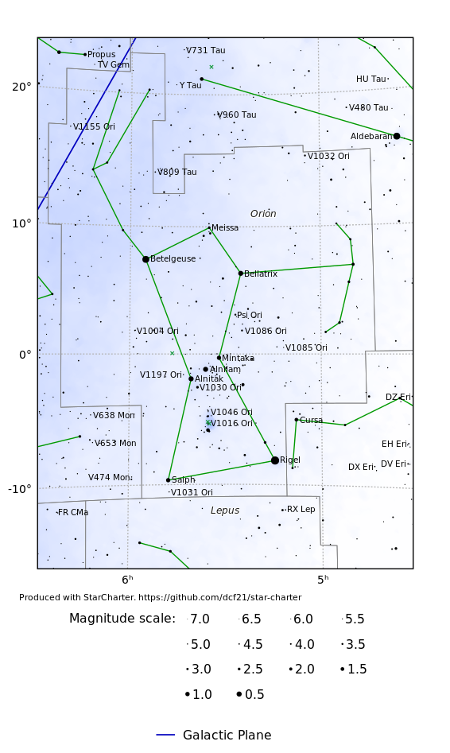

# StarCharter



`StarCharter` is a command-line tool for producing vector-graphics charts of
the night sky in SVG, PDF and PNG formats. It can also overlay the paths of
solar system objects, such as planets and comets, across the sky if the tool
[ephemerisCompute](https://github.com/dcf21/ephemeris-compute) is also
installed.

`StarCharter` was written to produce all of the star charts on the website
<https://in-the-sky.org>, which is maintained by the author.

### Supported operating systems

`ephemerisCompute` is written in C and runs in Linux, MacOS, and other
Unix-like operating systems.  The installation scripts require python3.
`StarCharter` uses `libcairo` to produce its graphical output.

### License

This code is distributed under the Gnu General Public License. It is (C)
Dominic Ford 2015 - 2020.

### Set up

Before you start, `StarCharter` needs to download various data from the
internet, including star catalogues, deep sky catalogues, and an image of the
Milky Way to use to shade the background of star charts.

This can be done with the shell script `setup.sh`. The total download size will
be around 500 MB.

## Generating a star chart

Once you have compiled the `StarCharter` code, you need to write a
configuration file to generate each star chart you want, specifying which
portion of the sky should be charted, and what labels you want on the chart.
There are some examples in the `examples` directory, and so a good starting
point is to generate one of these:

```
cd examples
../bin/starchart.bin orion.sch
```

This will generate three star charts in the `output` directory, in PNG, SVG and
PDF formats.

The file `orion.sch` reads as follows:

```
DEFAULTS
ra_central=5.5
dec_central=0.0
angular_width=25.0
width=12.0
aspect=1.41421356
ra_dec_lines=1
messier_names=0
constellation_boundaries=1
constellation_sticks=1
coords=ra_dec
projection=gnomonic
star_names=1
star_flamsteed_labels=0
constellation_names=1
plot_galaxy_map=1

CHART
output_filename=output/orion.png

CHART
output_filename=output/orion.svg

CHART
output_filename=output/orion.pdf

CHART
output_filename=output/orion.eps
```

Settings are arranged in blocks which are headed by the words `DEFAULTS` or
`CHART`. Settings in a `DEFAULTS` block do not themselves produce a star chart,
but change the default settings which are applied to all subsequent charts.
Settings in a `CHART` relate to a specific chart that is to be rendered, and do
not affect any subsequent charts which may be rendered later in the same
configuration file.

The file above configures a large number of parameters to produce a star chart
of the constellation Orion, and makes these the default settings. It then
produces three identical copies of the star chart, in three different graphic
formats.

The configuration settings which are recognised are listed below under
'Configuration settings'.

## Paths of solar system objects

The `draw_ephemeris` option in a configuration file can be used to draw the
path of a solar system object across the sky.  This requires the tool
[ephemerisCompute](https://github.com/dcf21/ephemeris-compute) to be installed.

The syntax is as follows:

```
draw_ephemeris = <body>,<jd_start>,<jd_end>
```

where `body` is the name of the solar system object to plot, and `jd_start` and
`jd_end` are the Julian day numbers of the beginning and end of the time period
for which the object's path should be plotted.

Recognised object names include any of the following:

* `p1`, `pmercury`, `mercury`: Mercury
* `p2`, `pvenus`, `venus`: Venus
* `p3`, `pearth`, `earth`: Earth
* `p301`, `pmoon`, `moon`: The Moon
* `p4`, `pmars`, `mars`: Mars
* `p5`, `pjupiter`, `jupiter`: Jupiter
* `p6`, `psaturn`, `saturn`: Saturn
* `p7`, `puranus`, `uranus`: Uranus
* `p8`, `pneptune`, `neptune`: Neptune
* `p9`, `ppluto`, `pluto`: Pluto
* `A<n>`: Asteroid number `n`, e.g. `A1` for Ceres, or `A4` for Vesta
* `C/1995 O1`. Comets may be referred to by their names in this format
* `1P/Halley`. Comets may be referred to by their names in this format
* `0001P`. Periodic comets may be referred to by their names in the format %4dP
* `CJ95O010`. Comets may be referred to by their Minor Planet Center designations
* `C<n>`: Comer number `n`. `n` is the line number within the file [Soft00Cmt.txt](http://www.minorplanetcenter.net/iau/Ephemerides/Comets/Soft00Cmt.txt), downloaded from the Minor Planet Center.

Note also the setting `ephemeris_autoscale`, which overrides the specified
celestial coordinates for the centre of the star chart, and the specified
angular width, and scales the star chart to automatically show the requested
ephemerides.

## Configuration settings

The following settings can be included in a `StarCharter` configuration file:

* `angular_width` - The angular width of the star chart on the sky, degrees
* `aspect` - The aspect ratio of the star chart: i.e. the ratio height/width
* `axis_label` - Boolean (0 or 1) indicating whether to write "Right ascension" and "Declination" on the vertical/horizontal axes
* `axis_ticks_value_only` - If 1, axis labels will appear as simply "5h" or "30 deg". If 0, these labels will be preceded by alpha= or delta=
* `cardinals` - Boolean (0 or 1) indicating whether to write the cardinal points around the edge of alt/az star charts
* `constellation_boundaries` - Boolean (0 or 1) indicating whether we draw constellation boundaries
* `constellation_boundary_col` - Colour to use when drawing constellation boundaries
* `constellation_label_col` - Colour to use when writing constellation names
* `constellation_names` - Boolean (0 or 1) indicating whether we label the names of constellations
* `constellation_stick_col` - Colour to use when drawing constellation stick figures
* `constellation_stick_design` - Select which design of constellation stick figures we should draw. Set to either 'simplified' or 'rey'. See <https://github.com/dcf21/constellation-stick-figures> for more information.
* `constellation_sticks` - Boolean (0 or 1) indicating whether we draw constellation stick figures
* `coords` - Select whether to use RA/Dec or galactic coordinates. Set to either 'ra_dec' or 'galactic'.
* `copyright_gap_2` - Spacing of the copyright text beneath the plot
* `copyright_gap` - Spacing of the copyright text beneath the plot
* `copyright` - The copyright string to write under the star chart
* `dec_central` - The declination at the centre of the plot, degrees
* `dec_line_count` - The number of declination lines to draw. If set to 18, then one line of RA every 10 degrees
* `draw_ephemeris` - Definitions of ephemerides to draw
* `ecliptic_col` - Colour to use when drawing a line along the ecliptic
* `ephemeris_autoscale` - Boolean (0 or 1) indicating whether to auto-scale the star chart to contain the requested ephemerides. This overrides settings for ra_central, dec_central and angular_width.
* `ephemeris_col` - Colour to use when drawing ephemerides for solar system objects
* `ephemeris_compute_path` - The path to the tool <ephemerisCompute>, used to compute paths for solar system objects. See <https://github.com/dcf21/ephemeris-compute>. If this tool is installed in the same directory as StarCharter, the default value should be <../ephemerisCompute/bin/ephem.bin>.
* `equator_col` - Colour to use when drawing a line along the equator
* `font_size` - A normalisation factor to apply to the font size of all text (default 1.0)
* `galactic_plane_col` - Colour to use when drawing a line along the galactic plane
* `galaxy_col0` - The colour to use to shade the dark parts of the map of the Milky Way
* `galaxy_col` - The colour to use to shade the bright parts of the map of the Milky Way
* `galaxy_map_filename` - The binary file from which to read the shaded map of the Milky Way
* `galaxy_map_width_pixels` - The number of horizontal pixels across the shaded map of the Milky Way
* `great_circle_key` - Boolean (0 or 1) indicating whether to draw a key to the great circles under the star chart
* `grid_col` - Colour to use when drawing grid of RA/Dec lines
* `label_ecliptic` - Boolean (0 or 1) indicating whether to label the months along the ecliptic, showing the Sun's annual progress
* `language` - The language used for the constellation names. Either "english" or "french".
* `mag_alpha` - The multiplicative scaling factor to apply to the radii of stars differing in magnitude by one <mag_step>
* `mag_max` - Used to regulate the size of stars. A star of this magnitude is drawn with size mag_size_norm. Also, this is the brightest magnitude of star which is shown in the magnitude key below the chart.
* `mag_min` - The faintest magnitude of star which we draw
* `magnitude_key` - Boolean (0 or 1) indicating whether to draw a key to the magnitudes of stars under the star chart
* `mag_size_norm` - The radius of a star of magnitude <mag_max> (default 1.0)
* `mag_step` - The magnitude interval between the samples shown on the magnitude key under the chart
* `maximum_star_count` - The maximum number of stars to draw. If this is exceeded, only the brightest stars are shown.
* `maximum_star_label_count` - The maximum number of stars which may be labelled
* `messier_col` - Colour to use when drawing Messier objects
* `messier_mag_labels` - Boolean (0 or 1) indicating whether we label the magnitudes of Messier objects
* `messier_names` - Boolean (0 or 1) indicating whether we label the names of Messier objects
* `ngc_col` - Colour to use when drawing NGC objects
* `ngc_mag_min` - Only show NGC objects down to this faintest magnitude
* `ngc_mags` - Boolean (0 or 1) indicating whether we label the magnitudes of NGC objects
* `ngc_names` - Boolean (0 or 1) indicating whether we label the names of NGC objects
* `output_filename` - The target filename for the star chart. The file type (svg, png, eps or pdf) is inferred from the file extension.
* `photo_filename` - The filename of a PNG image to render behind the star chart. Leave blank to show no image.
* `plot_ecliptic` - Boolean (0 or 1) indicating whether to draw a line along the ecliptic
* `plot_equator` - Boolean (0 or 1) indicating whether to draw a line along the equator
* `plot_galactic_plane` - Boolean (0 or 1) indicating whether to draw a line along the galactic plane
* `plot_galaxy_map` - Boolean (0 or 1) indicating whether to draw a shaded map of the Milky Way behind the star chart
* `plot_messier` - Boolean (0 or 1) indicating whether we plot any Messier objects
* `plot_ngc` - Boolean (0 or 1) indicating whether we plot any NGC objects
* `plot_stars` - Boolean (0 or 1) indicating whether we plot any stars
* `position_angle` - The position angle of the plot - i.e. the tilt of north, counter-clockwise from up, at the centre of the plot
* `projection` - Select projection to use. Set to either flat, peters, gnomonic, sphere or alt_az
* `ra_central` - The right ascension at the centre of the plot, hours
* `ra_dec_lines` - Boolean (0 or 1) indicating whether we draw a grid of RA/Dec lines in background of star chart
* `ra_line_count` - The number of RA lines to draw. If set to 24, then one line of RA every hour.
* `star_bayer_labels` - Boolean (0 or 1) indicating whether we label the Bayer numbers of stars
* `star_catalogue_numbers` - Boolean (0 or 1) indicating whether we label the catalogue numbers of stars
* `star_catalogue` - Select the star catalogue to use when showing the catalogue numbers of stars. Set to 'hipparcos', 'ybsc' or 'hd'.
* `star_col` - Colour to use when drawing stars
* `star_flamsteed_labels` - Boolean (0 or 1) indicating whether we label the Flamsteed designations of stars
* `star_label_mag_min` - Do not label stars fainter than this magnitude limit
* `star_mag_labels` - Boolean (0 or 1) indicating whether we label the magnitudes of stars
* `star_names` - Boolean (0 or 1) indicating whether we label the English names of stars
* `title` - The heading to write at the top of the star chart
* `width` - The width of the star chart, in cm
* `x_label_slant` - A slant to apply to all labels on the horizontal axes
* `y_label_slant` - A slant to apply to all labels on the vertical axes
* `zodiacal_only` - Boolean (0 or 1) indicating whether we plot only the zodiacal constellations
