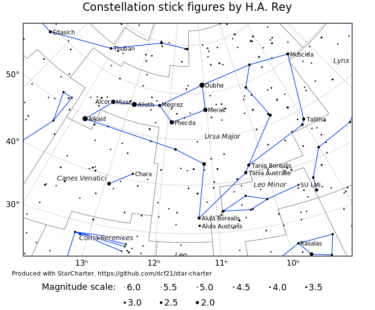
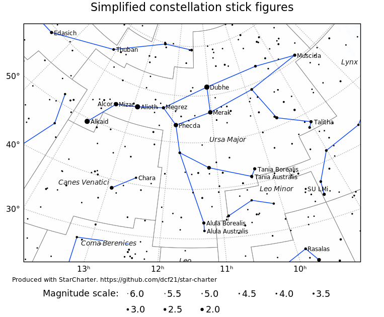

# Constellation stick figures

The files in this repository define stick figures which can be used to depict
the 88 astronomical constellations.

They were produced by the author for the purposes of generating all of the sky
charts on the website <https://in-the-sky.org>, which is maintained by the
author. They are also utilised by
[StarCharter](https://github.com/dcf21/star-charter), a command-line tool for
producing vector-graphics charts of the night sky, written by the author.

### Background

There is no defined standard shared between planetarium programs for which
stars should be connected in order to construct stick figures. However, the
idea of drawing such stick figures was popularised by H.A. Rey in his 1952
children's book *The Stars: A New Way To See Them*. Most planetarium programs
use some simplifications of the figures which appear in Rey's book.

For historical authenticity, the file `constellation_lines_rey.dat`  lists the
stick figures (almost) exactly as they appear in Rey's book, transcribed by the
author (Dominic Ford) from Rey's original diagrams into the Hipparcos catalog
numbers of the stars to be connected. Some of the figures are quite elaborate
and include connections to very faint stars (mag 5-6).

The file `constellation_lines_simplified.dat` lists some simplified stick
figures, invented by the author (Dominic Ford). They are similar to those used
in many planetarium programs, but considerably simpler than those which appear
in Rey's book. Specifically, some of Rey's stick figures include connections to
very faint stars (mag 5-6), whereas the figures below mostly only include stars
of fourth magnitude or brighter, except in the faintest constellations.

### Data format

Each line of the files `constellation_lines_simplified.dat` and
`constellation_lines_simplified.dat` list a series of stars, referenced by
their Hipparcos numbers (The Hipparcos star catalogue can be freely downloaded
here <http://cdsarc.u-strasbg.fr/viz-bin/Cat?I/239>).

To construct stick figures, connect each of the stars on each line in turn. At
the end of each line of the file, lift your pen and start a new line to connect
the list of stars on the next line of the file.

### Alternative data formats

For ease of use, these designs of stick figures are also available in the form
of a listing the RA and Dec (J2000) of the stars to be connected, or in the
form of the HR numbers of the stars (HR numbers are the catalogue numbers of
the stars in the Yale Bright Star Catalog).

The Python script `process_stick_figures/constellationLines.py` generates these
alternative data files from the original.

### License

This data is distributed under the Gnu General Public License. It is (C)
Dominic Ford 2015 - 2019.

