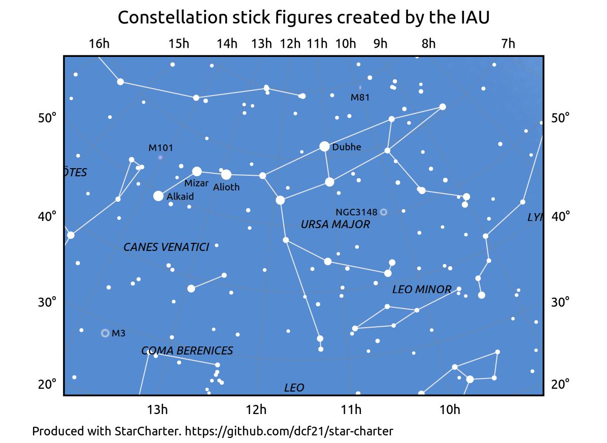
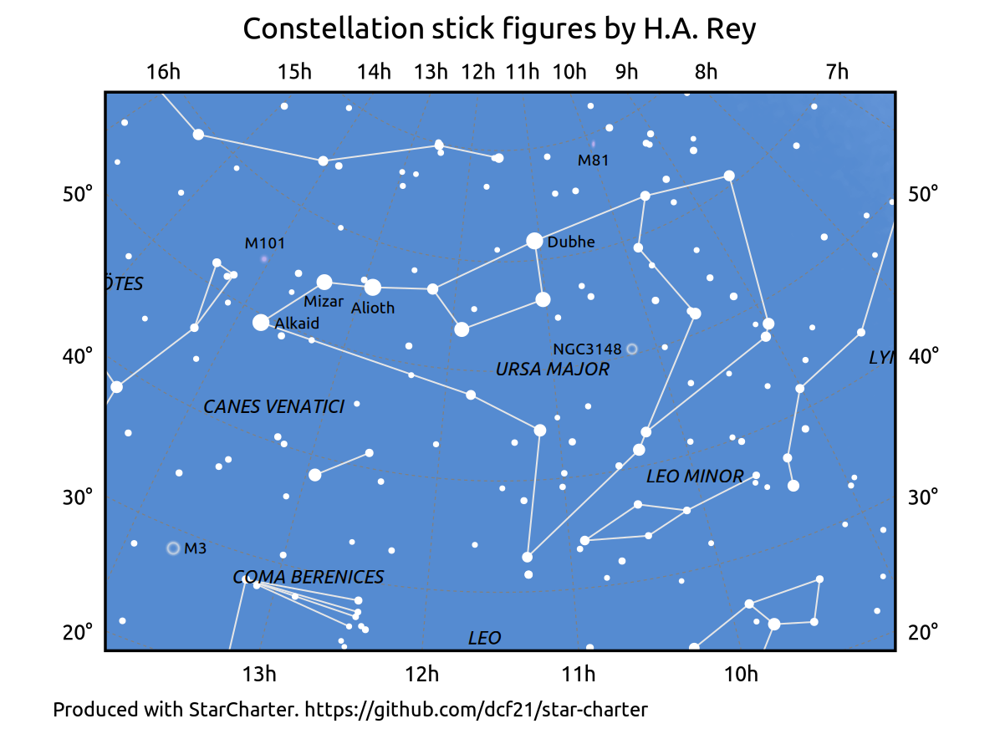
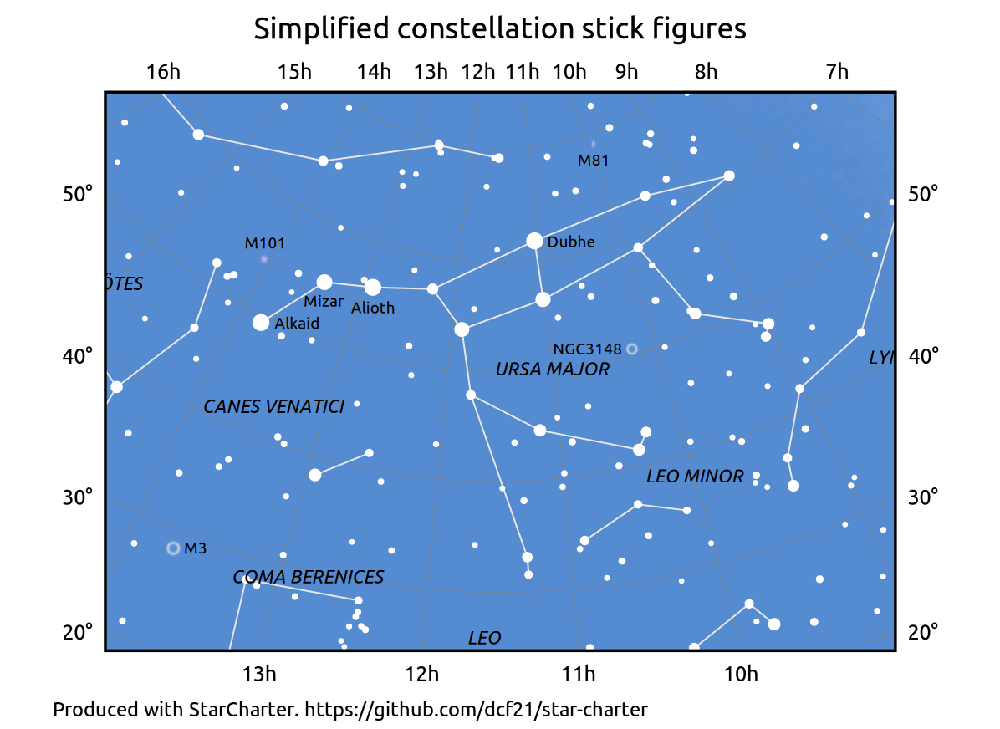

# Constellation stick figures

The files in this repository define stick figures which depict the 88 modern
astronomical constellations.

They were produced by the author for the purposes of generating the star charts
on the website [In-The-Sky.org](https://in-the-sky.org). They are also
utilised by [StarCharter](https://github.com/dcf21/star-charter), an
open-source command-line tool for producing vector-graphics charts of the night
sky, written by the author.

### Background

There is no single standard for which bright stars should be connected together
to form constellation stick figures: different sources draw the constellations
in different ways.

The idea of representing the constellations by stick figures was originally
popularised by H.A. Rey in his 1952 children's book *The Stars: A New Way To
See Them*. Rey created some quite elaborate figures, often using faint stars
that are hard to see with the unaided eye.

The International Astronomical Union (IAU) updated these in collaboration with
Alan MacRobert and Sky & Telescope magazine (date unknown); their updated stick
figures are shown [here](https://www.iau.org/public/themes/constellations/) and
are released under a [Creative Commons Attribution 4.0 International
license](https://creativecommons.org/licenses/by/4.0/).

However, most planetarium programs use their own bespoke simplifications of
these figures.

### Available files

This repository contains data files defining (a) the stick figures in Rey's
book, (b) the IAU stick figures, and (c) a simplified set created by the author
which closely resembled those used in many planetariums.

The source data files are as follows:

* The file [constellation_lines_iau.dat](constellation_lines_iau.dat) lists the
modern IAU stick figures, created by Alan MacRobert et al. They are released
under a [Creative Commons Attribution 4.0 International
license](https://creativecommons.org/licenses/by/4.0/).

* The file [constellation_lines_rey.dat](constellation_lines_rey.dat) lists the
historically authentic stick figures, as they appear in Rey's book, transcribed
by the author (Dominic Ford) from Rey's original diagrams. Some of the figures
are quite elaborate and include connections to very faint stars (mag 5-6).

* The file
[constellation_lines_simplified.dat](constellation_lines_simplified.dat) lists
simplified stick figures, invented by the author (Dominic Ford). They are
similar to those used in many planetarium programs, and are restricted to
include only stars of fourth magnitude or brighter, except in the faintest
constellations.  They are released under a [GNU General Public License
V3](https://www.gnu.org/licenses/gpl-3.0.en.html).

### Data format

Each line of the files
[constellation_lines_iau.dat](constellation_lines_iau.dat),
[constellation_lines_rey.dat](constellation_lines_rey.dat) and
[constellation_lines_simplified.dat](constellation_lines_simplified.dat) lists
a series of stars which should be joined together in sequence to make a stick
figure. The stars are referenced by their Hipparcos numbers; the Hipparcos star
catalogue can be freely [downloaded here](https://cdsarc.u-strasbg.fr/viz-bin/Cat?I/239).

To construct stick figures, connect the stars on each line in turn. At the end
of each line of the file, lift your pen and start a new line to connect the
list of stars on the next line of the file.

Some constellations are split over multiple lines while others are represented
by a single continuous line.

### Alternative data formats

For ease of use, these designs of stick figures are also available in the form
of a listing the RA and Dec (J2000) of the stars to be connected, or in the
form of the HR numbers of the stars (HR numbers are the catalogue numbers of
the stars in the Yale Bright Star Catalog).

The Python script

`process_stick_figures/constellationLines.py`

generates these alternative data files from the original.

### License

This data is distributed under the Gnu General Public License Version 3. It is ©
Dominic Ford 2015 - 2025.
