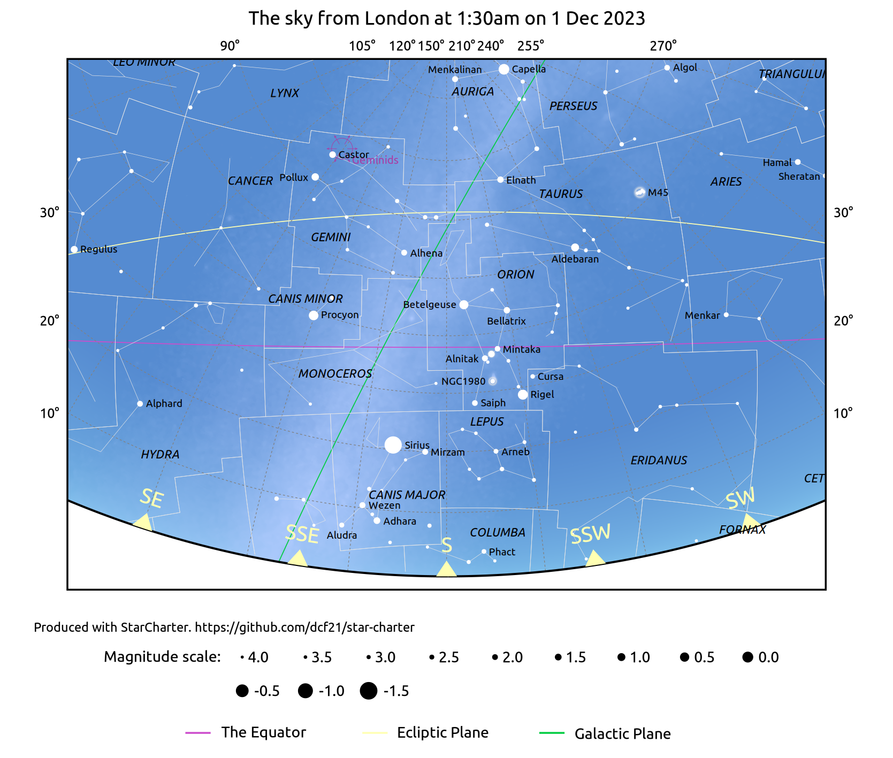
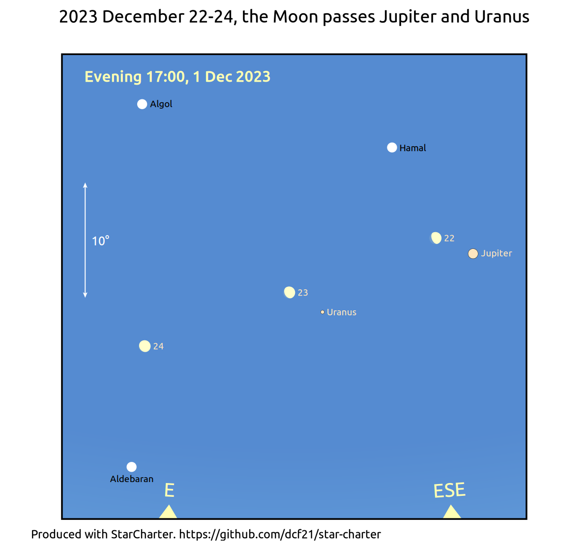
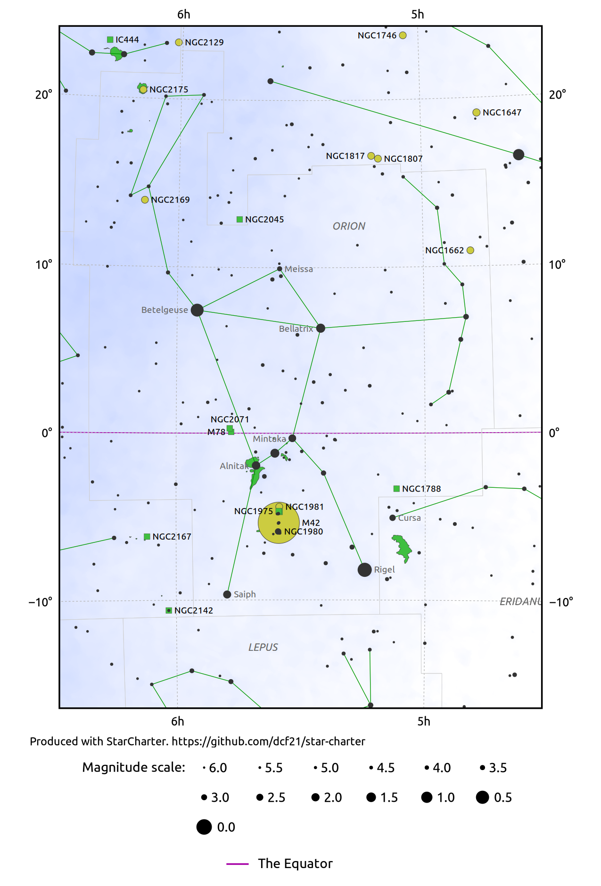
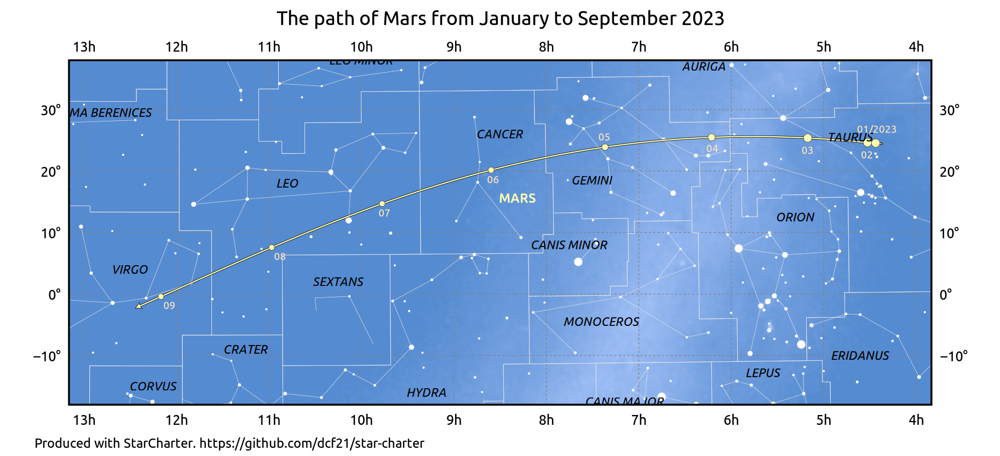
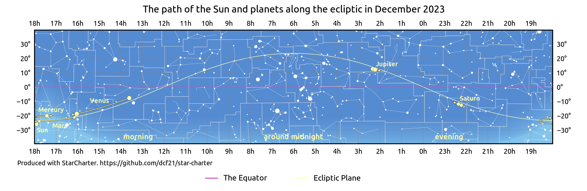

# StarCharter

[StarCharter](README.md)
\>
Example output

## Example output

This section shows a small number of examples of the output of `StarCharter`.

---
## The sky as seen looking south from London on 1 December 2023

[Click here to expand](example_output/local_sky_202312_wide.png).
Generated by [this script](examples/local_sky_202312_wide.sch).

---
## The location and phase of the Moon as it passes Jupiter and Uranus on 22-24 December 2023

[Click here to expand](example_output/local_sky_202312_moon_03.png).
Generated by [this script](examples/local_sky_202312_moon.sch).

---
## A chart of the constellation of Orion

[Click here to expand](example_output/orion_default.png).
Generated by [this script](examples/orion.sch).

---
## A chart of the path of Mars in the year 2025

[Click here to expand](example_output/demo_chart_2023_mars.png).
Generated by [this script](examples/demo_chart_2023_planets.sch).

---
## A chart of the paths of the planets along the ecliptic in December 2023

[Click here to expand](example_output/demo_chart_ecliptic_202312.png).
Generated by [this script](examples/demo_chart_202312_ecliptic.sch).

---

This code was developed by Dominic Ford <https://dcford.org.uk>. It is
distributed under the Gnu General Public License V3.